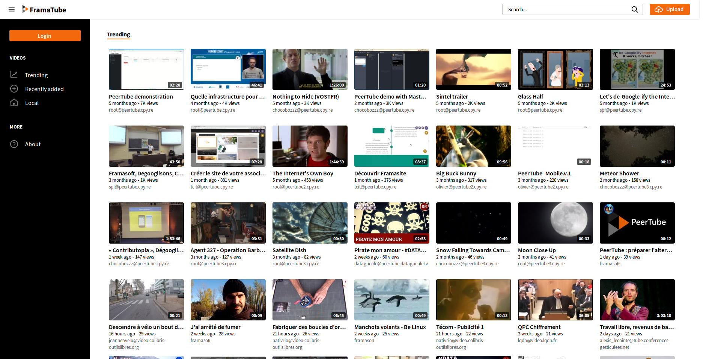

<!--
N.B.: This README was automatically generated by https://github.com/YunoHost/apps/tree/master/tools/README-generator
It shall NOT be edited by hand.
-->

# PeerTube for YunoHost

[](https://dash.yunohost.org/appci/app/peertube)    
[](https://install-app.yunohost.org/?app=peertube)

*[Lire ce readme en français.](./README_fr.md)*

> *This package allows you to install PeerTube quickly and simply on a YunoHost server.
If you don't have YunoHost, please consult [the guide](https://yunohost.org/#/install) to learn how to install it.*

## Overview

Federated (ActivityPub) video streaming platform using P2P (BitTorrent) directly in the web browser, using <a href="https://github.com/feross/webtorrent">WebTorrent</a>.


**Shipped version:** 5.0.0~ynh1

**Demo:** http://peertube.cpy.re

## Screenshots



## Disclaimers / important information

### Why PeerTube?

We can't build a FOSS video streaming alternatives to YouTube, Dailymotion, Vimeo... with a centralized software. One organization alone cannot have enough money to pay bandwidth and video storage of its server.

So we need to have a decentralized network of servers seeding videos  (as [Hubzilla YunoHost](https://github.com/YunoHost-Apps/hubzilla_ynh), [Friendica YunoHost](https://github.com/YunoHost-Apps/friendica_ynh),[Mastodon YunoHost](https://github.com/YunoHost-Apps/mastodon_ynh)), [Diaspora](https://github.com/diaspora/diaspora) ([Diaspora YunoHost](https://github.com/YunoHost-Apps/diaspora_ynh)),[Funkwhale](https://funkwhale.audio) ([Funkwhale YunoHost](https://github.com/YunoHost-Apps/funkwhale_ynh)).
But it's not enough because one video could become famous and overload the server.
It's the reason why we need to use a P2P protocol to limit the server load.
Thanks to [WebTorrent](https://github.com/feross/webtorrent), we can make P2P (thus BitTorrent) inside the web browser, as of today.

### Why is that cool?
Servers are run independently by different people and organizations. They can apply wildly different moderation policies, so you can find or make one that fits your taste perfectly.

By watching a video, you help the hosting provider to broadcast it by becoming a broadcaster of the video yourself. Each instance doesn't need much money to broadcast the videos of its users.

### IMPORTANT POINT TO READ BEFORE INSTALLING
* Require **dedicated domain** like **peertube.domain.tld**.
* Admin username is: **root**.
* **Admin password and LDAP configuration** will be sent to the email address given at the time of the installation.
* URL can not be changed once selected. Choose the domain wisely.
* You need more then **1 GB** of RAM. If you don't have it, please create a **swap memory**.
 
        $ dd if=/dev/zero of=/swapfile bs=1024 count=1048576
        $ mkswap /swapfile
        $ swapon /swapfile
        $ echo "/swapfile swap swap defaults 0 0" >> /etc/fstab
        
* This app is **multi-instance** (you can have more then one PeerTube instance running on a YunoHost server)
* **If you are hosted on OVH virtual machine or experiencing `gyp ERR! configure error`, please switch to [ovh_fix](https://github.com/YunoHost-Apps/peertube_ynh/tree/ovh_fix)**
* HTTP auth is not supported
* Do not modify the `/var/www/<app>/conf/production.yaml` file, because it will be overridden in the next upgrade. Please instead either change them though the web interface or create a `/var/www/<app>/conf/local.yaml` file, assign it the same owner, group and rights than for `conf/production.yaml` and fill there your specific settings.
    * Note: when the same option have different values in `production.yaml` and `local.yaml` files, only the value in `local.yaml` is taken into account.

### PLUGINS
* LDAP auth is supported, LDAP configuration will be sent to the email address given at the time of the installation.
* PeerTube plugin livechat is installed with Prosody. To enable, just select «Prosody server controlled by Peertube» as chat mode in the plugin configutation of the PeerTube admin page
* During install, because of Prosody, Metronome is disabled

## Documentation and resources

* Official app website: <https://joinpeertube.org/fr>
* Official admin documentation: <https://docs.joinpeertube.org>
* Upstream app code repository: <https://github.com/Chocobozzz/PeerTube>
* YunoHost documentation for this app: <https://yunohost.org/app_peertube>
* Report a bug: <https://github.com/YunoHost-Apps/peertube_ynh/issues>

## Developer info

Please send your pull request to the [testing branch](https://github.com/YunoHost-Apps/peertube_ynh/tree/testing).

To try the testing branch, please proceed like that.

``` bash
sudo yunohost app install https://github.com/YunoHost-Apps/peertube_ynh/tree/testing --debug
or
sudo yunohost app upgrade peertube -u https://github.com/YunoHost-Apps/peertube_ynh/tree/testing --debug
```

**More info regarding app packaging:** <https://yunohost.org/packaging_apps>
